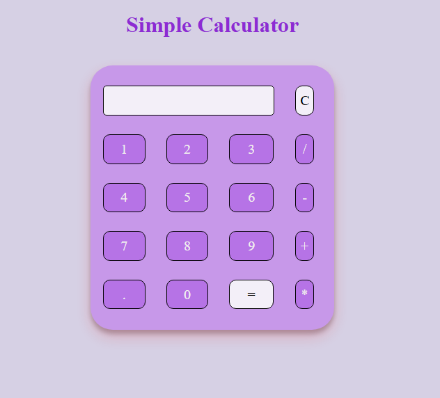

# simple-calculator
A simple, responsive calculator using HTML, CSS, and JavaScript for basic arithmetic — perfect for front-end beginners.

https://bhuvaneshwari-08.github.io/simple-calculator/

  

